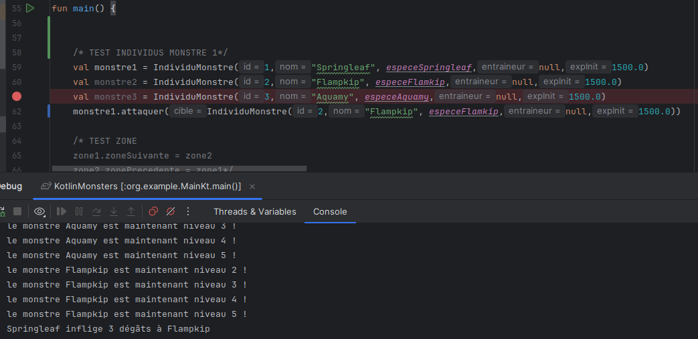

# Compte Rendu : Kotlin Monsters

## <ins>I/ Introduction

> Le jeu `Kotlin Monsters` est inspiré de Pokémon. Nous incarnons un dresseur polyvalent et plein de vie !
> 
> Le projet est réparti en (2/3 sprints) pour nous apprendre à travailler de façon ordonnée et autonome.

> `Objectifs` : 
> - Approfondir les acquis sur la Programmation Orientée Objet
> - Travailler en mode projet
> - Mise en place de bonnes pratiques (_documentation, commentaires_ ..)
> - Résolution de problèmes et bugs
> - Réalisation de tests
> - Utilisation des DAO

> `Technologies` : 
> - Kotlin
> - Gradle
> - MariaDB
> - JUnit5
> - Java DataBase Connector
> - IntelliJ
> - GitHub
> - P-UML

---

## <ins>II/ Développement du projet

### <mark>Sprint 1 :

> Cette partie consiste à créer toute la base du jeu, son noyau. Nous y retrouvons toutes les fonctions basiques pour faire tourner le jeu.

### Configuration : 

- Nous ajoutons le proxy (ou pas) dans le fichier `gradle.properties`.

- Nous importons les ressources utiles en téléchargeant le fichier zip. Puis, nous le décompressons dans le dossier `../main/resources`. 
L'intérieur du zip contient les **ASCII-Art** des monstres.

- En retournant dans `../main/kotlin`, nous créons tous les packages afin de regrouper des classes communes.

### Créations des classes :

- ### Entraineur
  - Cette classe représente un dresseur dans le jeu, c'est notre point d'entrée qui nous permettra de réaliser
  les différentes actions.
  - Elle possède des attributs propres à lui et une méthode.

- ### EspeceMonstre
  - Cette classe représente un type de monstre avec les statistiques de base.
  - Elle possède des attributs et une méthode.

- ### Zone
  - Cette classe représente un endroit dans le jeu. On va pouvoir créer des objets comme : une route, caverne ..
  - Elle possède des attributs et deux méthodes.  

- ### IndividuMonstre
  - Cette classe représente une instance unique d'un monstre appartenant à un joueur ou rencontré dans la nature.
  - Elle possède des attributs, on y retrouve les notions de get/set et il y a 5 méthodes.

- ### Item
  - Cette classe représente un objet physique dans le jeu appartenant au joueur.
  - Dans le principe d'héritage `Item` est la classe mère de : `MonsterKube` & `Badge`.
  - Elle va pouvoir transmettre ses attributs aux classes qui la mentionneront.

- ### Badge
  - Cette classe représente une récompense donnée au joueur à la fin d'un match.
  - Elle héritre des éléments de la classe `Item` et possède un attribut propre.
  - Dans notre configuration `Badge` est un sous type d'`Item`.

- ### Utilisable
  - Est une interface qui permet de séparer les Items en **deux groupes**. Ceux que l'on peut utiliser lors d'un combat ou non.
  - Elle possède une méthode.
  
- ### MonsterKube
  - Cette classe permet de capturer et de stocker des monstres sauvages.
  - Elle héritre des éléments de la classe `Item` et possède un attribut propre.
  - Comme pour Badge, <ins>MonsterKube</ins> est un sous type d'`Item`.
  - De plus elle implémente l'interface `Utilisable`.

- ### CombatMonstre
  - Cette classe représente un combat entre un **individu monstre du joueur** et **un autre individu monstre**.
  - Elle possède des attributs et 7 méthodes.

- ### Partie
  - Cette classe représente une session de jeu.
  - Elle possède des attributs et 4 méthodes.

A la fin ce sprint, nous pouvons nous : 

- [x] Déplacer dans différentes zones.
- [x] Rencontrer des monstres sauvages.
- [x] Combattre ou capturer des monstres sauvages.
- [x] Consulter et organiser son équipe de monstres.
- [x] Utiliser des objets pendant et hors combat.

### <mark>Sprint 3 :

> Dans cette partie nous mettons en place une connexion entre notre projet et une base de données relationnelle mariaDB.
> 
> On effectue cette procédure pour éviter de créer les éléments directement dans le code.
>
> On souhaite centraliser et stocker nos données pour les manipuler facilement.

### Configuration :

- Si pas encore fait, nous installons mariaDB.
- Nous créons la base de données dans intellij et nous la connectons en renseignant les informations.
- Puis, nous n'oublions pas de créer un fichier `tables.sql` dans le dossier `../../main/resources`.
- Il est important d'écrire tout ce que nous faisons dans `tables.sql`car la console n'est disponible qu'en local (_tout s'efface en la fermant_).

- ### Etape 2
    - Nous créons les tables en nous basant sur les classes existantes.
    - Seules : `Entraineur`, `EspeceMonstre`, `IndividuMonstre`, `Zone` & `Zone_EspeceMonstre` sont créés.
    - Pour mieux visualiser le projet, on télécharge et modifie le fichier `TODO ERD.puml` afin de faire correspondre les tables.

- ### Etape 3
  - On insère 3 entraineurs dans la table `Entraineur`.
  - On insère les espèces de monstre dans la table `EspeceMonstre`.
  - On insère les individus de monstre dans la table `IndividuMonstre` en faisant attention à quel entraineur ils sont reliés.

- ### Etape 4 
  - Pour rendre nos manipulations fluides, nous importons `Java DataBase Connector` et le plaçons les informations dans le fichier `build.gradle.kts`.
  - Cela va nous permettre d'envoyer des <ins>requêtes SQL</ins>, <ins>récupérer les résultats</ins> et <ins>gérer les transactions</ins>.
  - Nous créons un package JDBC dans lequel nous plaçons notre classe BDD.
  - La classe `BDD` gère les connexions et l'exécution des requêtes, on n'oublie pas de configurer les informations de connexion.

- ### Etape 5
  - Nous réalisons un test unitaire avec `JUnit5`. Pour vérifier si notre base de données peut communiquer avec <ins>Kotlin</ins>.
  - La table `Entraineur` sert d'exemple pour ce test.
  
- ### Etape 6
  - On crée un `Composant d'accès aux données` pour centraliser les interactions avec la base.
  - Dans notre projet les tables : `Entraineur`, `EspeceMonstre`, `IndividuMonstre` possèdent un DAO.
  - On y renseigne dedans les opérations CRUD[^1]
[^1]: create, read, update, delete
  
- ### Etape 7
  - On établit une connexion à la base de données.
  - On teste si notre joueur se crée automatiquement grâce à la méthode `.save()`.

- ### Etape 8
  - Création des DAO pour `EspeceMonstre` & `IndividuMonstre`.

- ### Etape 9 
  - Création de l'EspeceMonstre `IceeFreezy`.

A la fin ce sprint, nous pouvons :

- [x] Intégrer d’une BDD via JDBC.
- [x] Gestionner des sauvegardes via fichiers.

---

## III/ <ins>Résultats et tests :

SPRINT 1

SPRINT 3

---

## IV/ <ins>Bilan et conclusion :

> Ce projet conséquent m'a permis d'appliquer toutes les notions vues et de mieux comprendre les concepts étudiés récemment. J'ai appris à exploiter des fonctionnalités d'intelliJ que je ne connaissais pas jusqu'à présent.
>
> Je trouve que travailler sur un tel projet est enrichissant et nous permet de nous demander quelles sont les exigences qu'on attendrait de moi si c'était à produire pour un client.
